# Tier 1 data model

The schema is `apps/api/prisma/schema.prisma`. The `domain` migration was generated with Prisma Migrate and then extended with PostgreSQL partial indexes and checks. UUIDs identify rows; order numbers and invoice numbers are human-facing identifiers. Every table has `created_at` and `updated_at`. Instants use `timestamptz`, delivery dates use `date`, and money uses integer cents.

## Entity relationships

```mermaid
erDiagram
  STAFF_USERS ||--o{ SESSIONS : authenticates
  STAFF_USERS ||--o{ ORDERS : creates
  SETTINGS { string key PK }
  KITCHEN_HOLIDAYS { uuid id PK }
  ALLERGENS ||--o{ DISH_ALLERGENS : labels
  ALLERGENS ||--o{ OPTION_ALLERGENS : labels
  ALLERGENS ||--o{ EMPLOYEE_ALLERGENS : identifies
  DIETARY_TAGS ||--o{ DISH_DIETARY_TAGS : labels
  DIETARY_TAGS ||--o{ OPTION_DIETARY_TAGS : labels
  DIETARY_TAGS ||--o{ EMPLOYEE_DIETARY_TAGS : identifies
  KITCHEN_STATIONS ||--o{ DISHES : routes
  DISHES ||--o{ DISH_ALLERGENS : has
  DISHES ||--o{ DISH_DIETARY_TAGS : has
  DISHES ||--o{ OPTION_GROUPS : offers
  OPTIONS ||--o{ OPTION_ALLERGENS : has
  OPTIONS ||--o{ OPTION_DIETARY_TAGS : has
  OPTION_GROUPS ||--o{ OPTION_GROUP_OPTIONS : offers
  OPTIONS ||--o{ OPTION_GROUP_OPTIONS : reused_in
  PRICE_TIERS ||--o{ PRICE_ENTRIES : overrides
  PRICE_TIERS ||--o{ PRICE_TIERS : derives_from
  PRICE_TIERS ||--o{ COMPANIES : assigned_to
  COMPANIES ||--o{ COMPANY_DOMAINS : claims
  COMPANIES ||--o{ COMPANY_ADDRESSES : delivers_to
  COMPANIES ||--o{ COMPANY_HOLIDAYS : closes_on
  COMPANIES ||--o{ EMPLOYEES : employs
  EMPLOYEES ||--o{ EMPLOYEE_ALLERGENS : has
  EMPLOYEES ||--o{ EMPLOYEE_DIETARY_TAGS : prefers
  MENU_CATEGORIES ||--o{ MENU_ITEMS : contains
  DISHES ||--o{ MENU_ITEMS : listed_as
  COMPANIES ||--o{ COMPANY_HIDDEN_CATEGORIES : hides
  MENU_CATEGORIES ||--o{ COMPANY_HIDDEN_CATEGORIES : hidden_for
  COMPANIES ||--o{ COMPANY_HIDDEN_ITEMS : hides
  MENU_ITEMS ||--o{ COMPANY_HIDDEN_ITEMS : hidden_for
  EMPLOYEES ||--o{ ORDERS : receives
  COMPANIES ||--o{ ORDERS : billed_for
  COMPANY_ADDRESSES ||--o{ ORDERS : delivered_to
  ORDERS ||--o{ ORDER_LINES : contains
  DISHES ||--o{ ORDER_LINES : snapshot_of
  ORDER_LINES ||--o{ ORDER_LINE_COMBOS : splits_into
  ORDERS ||--o{ ORDER_EVENTS : timeline
  ORDER_LINE_COMBOS ||--o| PREP_UNITS : prepared_as
  ORDERS ||--o| ORDER_KITCHEN_STATE : tracks
  COMPANIES ||--o{ DROPS : receives
  COMPANY_ADDRESSES ||--o{ DROPS : destination
  DROPS ||--o{ ORDER_DISPATCH_STATE : groups
  ORDERS ||--o| ORDER_DISPATCH_STATE : tracks
  COMPANIES ||--o{ INVOICES : billed_by
  INVOICES ||--o{ ORDERS : contains
  CUTOFF_RUNS { date delivery_date UK }
```

`PRICE_ENTRIES.subject_id` identifies either a dish or an option according to `subject_type`. It cannot have a conventional foreign key to both tables; the pricing service verifies existence. Snapshot JSON fields are `orders.address_snapshot`, `order_lines.dish_snapshot`, `order_line_combos.options_snapshot`, and `order_events.meta`. All live links, including company working days (a PostgreSQL integer array), are typed columns or relations.

## Ownership

| Module | Tables |
|---|---|
| auth | `staff_users`, `sessions` |
| settings | `settings`, `kitchen_holidays` |
| reference | `allergens`, `dietary_tags`, `kitchen_stations` |
| catalogue | `dishes`, `options`, `option_groups`, `option_group_options`, `dish_allergens`, `dish_dietary_tags`, `option_allergens`, `option_dietary_tags` |
| pricing | `price_tiers`, `price_entries` |
| companies | `companies`, `company_domains`, `company_addresses`, `company_holidays` |
| employees | `employees`, `employee_allergens`, `employee_dietary_tags` |
| menu | `menu_categories`, `menu_items`, `company_hidden_categories`, `company_hidden_items` |
| orders | `orders`, `order_lines`, `order_line_combos`, `order_events`, `cutoff_runs` |
| kitchen | `prep_units`, `order_kitchen_state` |
| dispatch | `drops`, `order_dispatch_state` |
| billing | `invoices` |
| core, dashboards, demo | No owned tables |

## Invariants and enforcement

| Invariant | Database enforcement | Service responsibility |
|---|---|---|
| At most one default tier; at most one default address per company | Partial unique indexes | Ensure one exists when creating or changing tiers and companies; prevent deactivating the default tier. |
| Lowercase employee and billing emails, domains, dish SKUs, staff emails | `CHECK` constraints (staff in the auth migration) and unique indexes where appropriate | Normalize before writes; validate domain syntax, public-domain ban, and employee email/company-domain match. |
| Positive dish minimum and order quantities; non-negative costs, prices, totals, lead time, counters and version | `CHECK` constraints | Ensure line quantity meets dish minimum, dish manual prices are positive, and snapshots reconcile. |
| Valid references, unique domain, SKU, tier name, employee email, menu link, option membership, combo key and drop grouping | Foreign keys and unique indexes | Validate active status, ownership and permissions. Deactivate historical entities instead of deleting. |
| One owner employee belonging to its company, default driver with driver permission, address belonging to order company | Foreign keys establish existence | Check same-company and role permissions before assignment. |
| Working days are 1 through 7 and nonempty | PostgreSQL array `CHECK` | Enforce no duplicates and calendar eligibility. |
| Tier derivation is acyclic, at most five steps; subject points to a dish or option | Tier self-FK; subject type enum | Validate derivation fields, cycle/depth, and polymorphic subject existence. |
| Menu visibility, option membership, required groups and price availability | Relational links and uniqueness | Resolve the effective tier and validate the menu and choices on every save and place. |
| Cut-off idempotency; order and dispatch transitions | Unique `cutoff_runs.delivery_date`, one-to-one state rows | Use order row locks, conditional updates, kitchen `Clock`, and transaction-level advisory locks. |
| Invoice has orders from one company, correct total, and billable statuses | One nullable invoice FK per order; non-negative total | Attach with a conditional update in one transaction, reconcile sums, and lock invoiced money. |
| Snapshotted prices and delivery details | Typed cents and JSON columns | Copy validated current values when ordering; never re-price old snapshots. |

## Indexes

| Index or group | Purpose |
|---|---|
| `orders(delivery_date,status)` | Cut-off processing and date/status board filters. |
| `orders(company_id,delivery_date)` | Company history and billing candidate lookup. |
| `orders(invoice_id)` | Invoice item lookup and uninvoiced filter. |
| `order_line_combos(order_line_id)`, `order_lines(order_id)` | Fetch full order detail and prep combinations. |
| `prep_units(combo_id)` unique plus index | One prep unit per combo and lookup from a combo. |
| `drops(delivery_date,driver_id)` | Driver's today view and date board. |
| `employees(company_id)` | Company roster and scoped employee lookup. |
| `menu_items(category_id,sort_order)`, `option_groups(dish_id,sort_order)`, `menu_categories(sort_order)` | Ordered menu and option group rendering. |
| `price_entries(tier_id,subject_type,subject_id)` unique | One manual override per tier and subject; direct price lookup. |
| `company_addresses(company_id)`, `company_domains(company_id)` | Company detail. Partial address index enforces a single default. |
| `order_events(order_id,at)`, `order_dispatch_state(drop_id)` | Timelines and drop board aggregation. |
| Other relation-key indexes | Join and reverse lookup on the foreign key; unique constraints also provide lookup indexes. |

The fixed fixture set in `apps/api/prisma/test-fixtures.ts` is callable from integration tests. It creates three companies, six employees, twelve dishes, three tiers (one cost-derived and one derived from another tier), a secret menu category and one company-hidden menu item. It does not create staff accounts.
